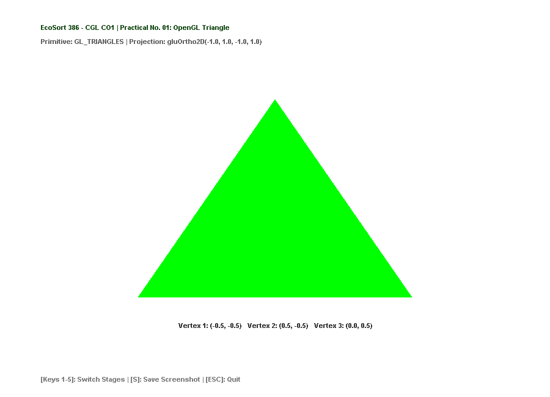
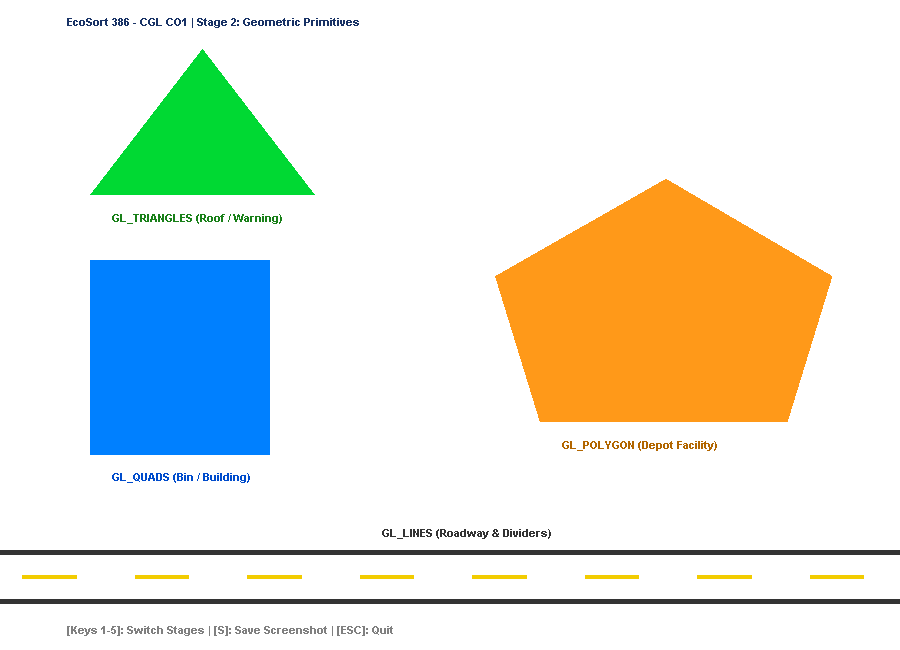
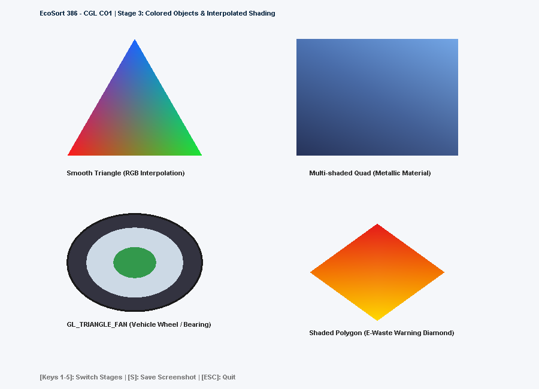
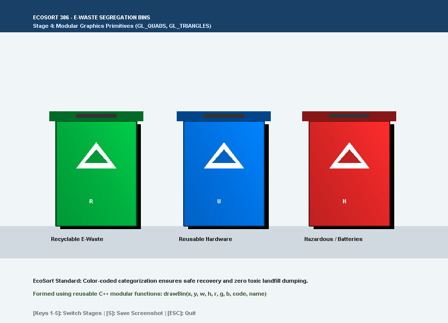
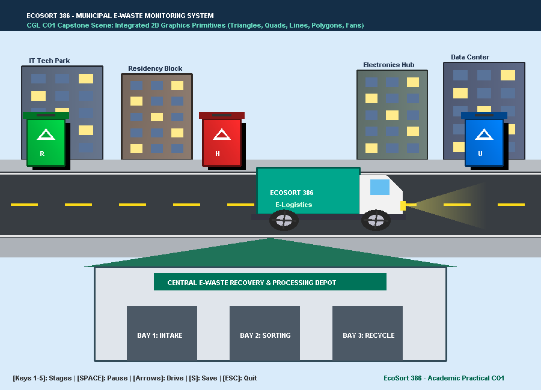

# EcoSort 386 — Computer Graphics Laboratory (CGL)
## Course Outcome 1 (CO1) — Week 1: OpenGL Graphics Primitives

---

### 📋 Academic Practical Information
- **Course Outcome (CO1)**: *Apply OpenGL graphics primitives to develop graphics applications.* `[Bloom's Taxonomy Level: L3 - Apply]`
- **Practical No. 01**: Draw a triangle using OpenGL, followed by drawing geometric objects, shading them with different colors, and composing an domain-specific graphics scene.
- **Application Context**: **EcoSort 386** — Smart Municipal E-Waste Segregation & Recovery System.

---

## 🎯 Aim & Objectives

1. Initialize an OpenGL rendering pipeline with GLFW and set up an orthographic 2D coordinate system using `gluOrtho2D(-1.0, 1.0, -1.0, 1.0)`.
2. Master fundamental OpenGL drawing primitives:
   - `GL_TRIANGLES`: Triangle vertices, industrial roofs, warning indicators.
   - `GL_QUADS`: Rectangular bodies, e-waste bin containers, urban buildings, and bay doors.
   - `GL_LINES`: Road boundaries, lane divider markings, and outlines with variable line widths (`glLineWidth`).
   - `GL_POLYGON`: Multi-sided convex polygons for facility silhouettes and vehicle cabins.
   - `GL_TRIANGLE_FAN`: Trigonometric circular approximations for vehicle wheels, tires, and hubs.
3. Apply color attributes and smooth Gouraud color interpolation across primitive vertices (`glColor3f`, `glColor4f`).
4. Develop reusable, modular C++ rendering routines (`drawEcoSortBin`, `drawBuilding`, `drawEwasteTruck`, `drawCircle`).
5. Compose a 2D capstone graphics scene representing the EcoSort 386 urban e-waste recovery infrastructure.

---

## 📁 Repository Structure

```text
EcoSort386/
├── CGL/
│   └── CO1/
│       ├── main.cpp                    # Complete GLFW C++ progressive implementation
│       ├── build_co1.bat               # Single-click build and verification script
│       ├── run_co1.bat                 # Interactive launcher script
│       ├── README.md                   # Practical documentation & report
│       ├── triangle_output.png         # Evidence 1: Practical No. 01 Triangle
│       ├── primitives_output.png       # Evidence 2: Geometric primitives
│       ├── colored_objects.png         # Evidence 3: Color shading & circle fan
│       ├── ecosort_bins.png            # Evidence 4: 3 EcoSort segregation bins
│       └── ecosort_week1_final.png     # Evidence 5: Complete EcoSort 2D scene
├── COA/                                # Computer Organization & Architecture
├── PL/                                 # Programming Laboratory
└── PSOOP/                              # Principles of Object Oriented Programming
```

---

## 🔬 Mathematical & Graphical Foundations

### 1. 2D Orthographic Viewing Pipeline
The program configures a normalized 2D orthographic coordinate system:
```cpp
glMatrixMode(GL_PROJECTION);
glLoadIdentity();
gluOrtho2D(-1.0, 1.0, -1.0, 1.0);
```
In this space:
- `(-1.0, -1.0)` corresponds to the bottom-left of the viewport.
- `(1.0, 1.0)` corresponds to the top-right of the viewport.
- `(0.0, 0.0)` is the center of the viewport.

### 2. Primitive Geometry Mapping in EcoSort 386

| OpenGL Primitive | Mathematical Definition | EcoSort 386 Domain Mapping |
| :--- | :--- | :--- |
| `GL_TRIANGLES` | Triplets of vertices $(v_0, v_1, v_2)$ defining planar triangles | Practical 01 test triangle; facility roof; bin recycling emblems; headlight beam |
| `GL_QUADS` | Quadruplets $(v_0, v_1, v_2, v_3)$ defining quadrilaterals | E-waste bin bodies, drop lids, urban buildings, intake bay doors, road surface |
| `GL_LINES` | Pairs of vertices $(v_0, v_1)$ defining line segments | Road curb edges, asphalt lane divider dashes (`glLineWidth`) |
| `GL_POLYGON` | Ordered convex sequence of $N$ vertices | Truck cab aerodynamic profile; depot facility structure; hazard diamond |
| `GL_TRIANGLE_FAN` | Center vertex $v_0$ connected to successive perimeter vertices $v_i, v_{i+1}$ | Vehicle wheels (tire rubber, metallic hubcaps) generated via $x = r\cos\theta, y = r\sin\theta$ |

### 3. Circle Generation via `GL_TRIANGLE_FAN`
Since legacy OpenGL does not have a native `glCircle` primitive, circles are rendered by tessellating $N$ radial triangles originating from a center $(c_x, c_y)$:
$$\theta_i = \frac{2\pi \cdot i}{N}, \quad x_i = c_x + r\cos(\theta_i), \quad y_i = c_y + r\sin(\theta_i)$$

```cpp
void drawCircle(float cx, float cy, float radius, int segments, float r, float g, float b) {
    glColor3f(r, g, b);
    glBegin(GL_TRIANGLE_FAN);
        glVertex2f(cx, cy);
        for (int i = 0; i <= segments; ++i) {
            float theta = 2.0f * M_PI * (float)i / (float)segments;
            glVertex2f(cx + radius * cosf(theta), cy + radius * sinf(theta));
        }
    glEnd();
}
```

---

## 📸 Progressive Implementation Stages & Visual Evidence

### Stage 1: Practical No. 01 — Basic OpenGL Triangle
- **Objective**: Verify OpenGL window setup, viewport configuration, and single primitive rasterization.
- **Vertices**: `(-0.5, -0.5)`, `(0.5, -0.5)`, `(0.0, 0.5)`.
- **Evidence File**: `triangle_output.png`



---

### Stage 2: Geometric Primitives
- **Objective**: Combine multiple distinct OpenGL primitives in a unified coordinate frame.
- **Elements**:
  - Triangle (`GL_TRIANGLES`): Warning/roof structure
  - Rectangle (`GL_QUADS`): Solid container block
  - Polygon (`GL_POLYGON`): 5-sided convex depot facility
  - Roadway (`GL_LINES`): Solid curbs and dashed center divider lines
- **Evidence File**: `primitives_output.png`



---

### Stage 3: Colored Objects & Interpolated Shading
- **Objective**: Demonstrate Gouraud color interpolation where differing vertex colors blend smoothly across primitive surfaces, and introduce circle fans.
- **Elements**:
  - RGB Interpolated Triangle (Red, Green, Blue vertex blending)
  - Metallic Gradient Quad (Navy to sky blue quad)
  - Circular Wheel & Bearing (`GL_TRIANGLE_FAN` with concentric layers)
  - Hazard Diamond (`GL_POLYGON` with radial color gradient)
- **Evidence File**: `colored_objects.png`



---

### Stage 4: EcoSort Segregation Bins (Domain Objects)
- **Objective**: Transform abstract geometric primitives into reusable, parameterized EcoSort domain components.
- **Implementation**: `drawEcoSortBin(x, y, w, h, r, g, b, code, name)`
  - **Recyclable Bin (`R`, Green)**: Electronics suitable for component harvesting and precious metal recovery.
  - **Reusable Bin (`U`, Blue)**: Refurbishable computing equipment and peripherals.
  - **Hazardous Bin (`H`, Red)**: Lithium-ion batteries, lead-acid cells, and toxic cathode-ray elements.
- **Evidence File**: `ecosort_bins.png`



---

### Stage 5: Capstone EcoSort 386 2D Scene
- **Objective**: Integrate all primitives and modular components into an interactive, multi-layered urban e-waste recovery ecosystem.
- **Scene Architecture**:
  1. **Header HUD**: System status banner with GLUT bitmap typography.
  2. **Skyline**: 4 architectural buildings with randomized illuminated window grids.
  3. **Transportation Grid**: Two-lane asphalt road with curbs, sidewalks, and yellow lane dividers.
  4. **Smart E-Bins**: Curbside IoT collection points with identification badges.
  5. **EcoSort Logistics Vehicle**: E-waste transport truck featuring an aerodynamic cab, cargo bed, illuminated headlight beam, and circular wheels.
  6. **Central Processing Depot**: Industrial facility with pitched emerald roof, 3 operational intake/sorting bays, and signage.
- **Evidence File**: `ecosort_week1_final.png`



---

## ⚡ Compilation & Execution Instructions

### Prerequisites
- **Operating System**: Windows 10/11
- **Compiler**: LLVM-MinGW (Clang++)
- **Libraries**: GLFW static library (`libglfw3.a`), OpenGL32, GLU32, GDI32, User32

### One-Click Build & Run
From the `EcoSort386/CGL/CO1/` directory:

1. **Compile the program**:
   ```cmd
   build_co1.bat
   ```

2. **Launch the interactive application**:
   ```cmd
   run_co1.bat
   ```
   *Or double-click `run_co1.bat` in Windows Explorer.*

3. **Batch Regenerate all 5 Evidence PNGs**:
   ```cmd
   build_co1.bat --capture-all
   ```

### Interactive Keyboard & Mouse Controls
| Control | Action |
| :--- | :--- |
| `1` – `5` | Switch stages (`5` = Smart E-Waste Deposit Kiosk & Dispatch) |
| **Mouse Click on Bins** | Click any of the 3 bins to select category (**R**: Recycle, **H**: Hazard, **U**: Reuse) |
| `R` / `H` / `U` Keys | Hotkey to select waste category and update live reward credit preview |
| **Mouse Click on Button** | Click `[>> CLICK TO DEPOSIT <<]` button to trigger deposit transaction |
| `D` or `ENTER` Keys | Hotkey to execute deposit transaction & dispatch collection truck |
| `SPACE` | **Pause / Resume** automatic animation |
| `LEFT` / `RIGHT` | **Manual Drive**: Nudge the truck along the roadway |
| `S` or `s` | Save high-resolution PNG screenshot of active stage |
| `ESC` | Exit application cleanly |

### 🔄 Multi-Subject Integration: CGL $\leftrightarrow$ PL / PSOOP
The graphics interface functions as the **Human-Machine Interface (HMI)** for EcoSort:
1. **User Input / Selection**: Selecting waste category sets reward incentives (+40 Cr for R, +60 Cr for H, +80 Cr for U).
2. **Transaction Ledger Execution**: Triggering `[DEPOSIT]` dispatches the truck to the designated processing bay (Bay 1: Recyclable Intake, Bay 2: Hazardous Quarantine, Bay 3: Reusable Grading).
3. **Graphic Feedback**: Truck arrival logs the transaction as `COMPLETED`, adds credits to user balance, and illuminates the bay!

---

## 💡 Key Code Highlights

### Modular Parameterized Bin Rendering
```cpp
void drawEcoSortBin(float x, float y, float w, float h,
                    float r, float g, float b,
                    const char* categoryCode, const char* categoryName,
                    bool showBottomLabel, float labelR, float labelG, float labelB)
{
    // 1. Drop shadow for depth perception
    glColor4f(0.0f, 0.0f, 0.0f, 0.15f);
    glBegin(GL_QUADS);
        glVertex2f(x + 0.02f, y - 0.02f);
        glVertex2f(x + w + 0.02f, y - 0.02f);
        glVertex2f(x + w + 0.02f, y + h - 0.02f);
        glVertex2f(x + 0.02f, y + h - 0.02f);
    glEnd();

    // 2. Bin body with subtle vertical shading
    glBegin(GL_QUADS);
        glColor3f(r * 0.85f, g * 0.85f, b * 0.85f);
        glVertex2f(x, y);
        glColor3f(r, g, b);
        glVertex2f(x + w, y);
        glColor3f(r * 1.15f, g * 1.15f, b * 1.15f);
        glVertex2f(x + w, y + h);
        glColor3f(r * 0.95f, g * 0.95f, b * 0.95f);
        glVertex2f(x, y + h);
    glEnd();

    // 3. Recyclable emblem (GL_TRIANGLES)
    glBegin(GL_TRIANGLES);
        glColor3f(1.0f, 1.0f, 1.0f);
        glVertex2f(x + w * 0.25f, y + h * 0.55f);
        glVertex2f(x + w * 0.75f, y + h * 0.55f);
        glVertex2f(x + w * 0.50f, y + h * 0.80f);
    glEnd();

    // 4. Identification Code (R / U / H)
    void* codeFont = (w < 0.2f) ? GLUT_BITMAP_HELVETICA_18 : GLUT_BITMAP_TIMES_ROMAN_24;
    renderText(x + (w < 0.2f ? w * 0.35f : w * 0.42f), y + h * 0.22f, categoryCode, codeFont, 1.0f, 1.0f, 1.0f);
}
```

---

## 🎯 Conclusion & Progression to Week 2 (CO2)

In this practical, Course Outcome 1 (CO1) was achieved at Bloom's Taxonomy Level 3 (Apply). We moved beyond trivial isolated shapes by mapping OpenGL primitives directly to the **EcoSort 386** e-waste recovery domain.

In the upcoming module (**Week 2 / CO2: Rasterization & Scan Conversion**), we will implement fundamental rasterization algorithms:
- **DDA Line Drawing Algorithm**
- **Bresenham’s Line Algorithm**
- **Midpoint Circle Drawing Algorithm**

These will form the underlying algorithmic foundation for plotting route vectors, collection pathways, and sensor radiuses across the EcoSort 386 map.
