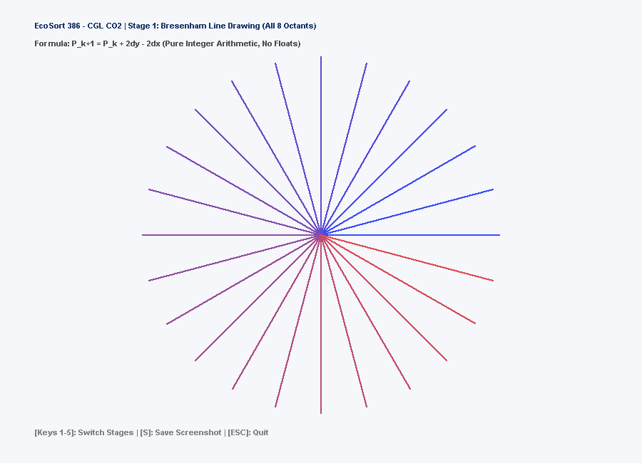
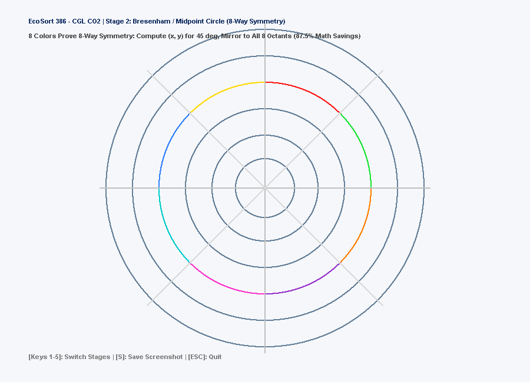
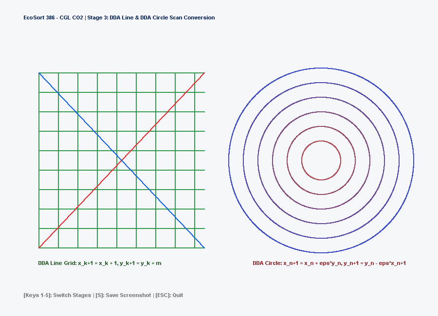
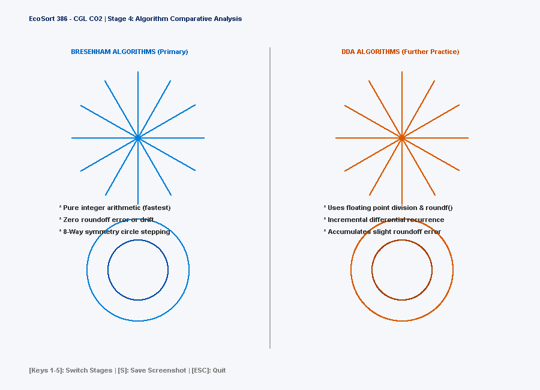
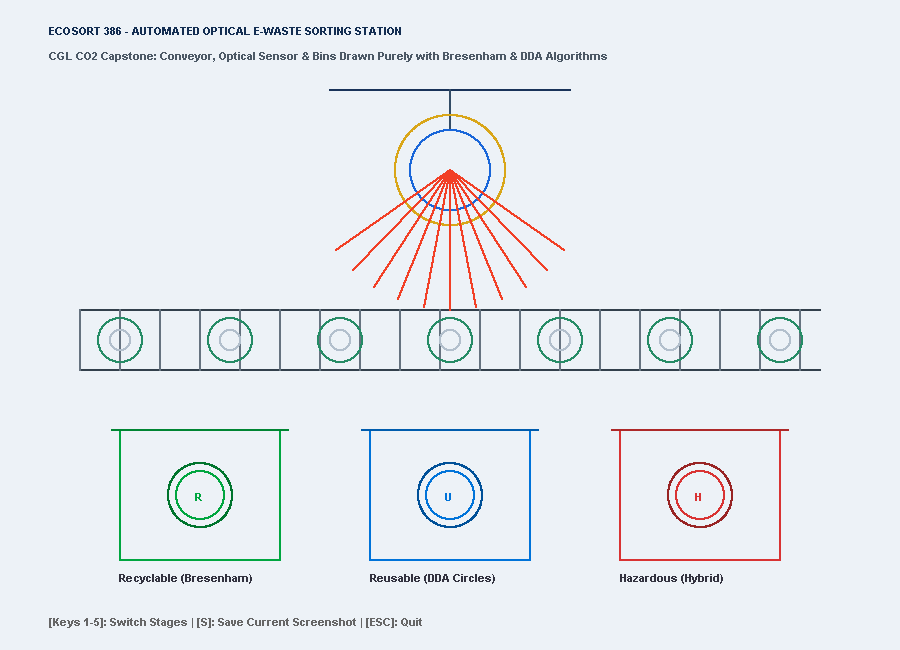

# EcoSort 386 — Computer Graphics Laboratory (CGL)
## Course Outcome 2 (CO2) — Week 2: Bresenham's & DDA Line and Circle Drawing Algorithms

---

### 📋 Academic Practical Information
- **Course Outcome (CO2)**: *Implement Bresenham’s Line and Circle drawing algorithm. Further practice: Implement DDA Line and Circle algorithm.* `[Bloom's Taxonomy Level: L3 - Apply]`
- **Practical Duration**: 2 Hours
- **Application Context**: **EcoSort 386** — Automated Optical Inspection & Conveyor E-Waste Sorting Station.

---

## 🎯 Aim & Objectives

1. Implement **Bresenham’s Line Drawing Algorithm** using pure integer arithmetic to scan-convert lines across all 8 octants ($|m| < 1$, $|m| \ge 1$, horizontal, vertical, and diagonal).
2. Implement **Bresenham’s / Midpoint Circle Drawing Algorithm** utilizing **8-way symmetry** to compute points for an octant ($45^\circ$) and mirror them to the remaining 7 octants (achieving $87.5\%$ calculation savings).
3. Implement the **Digital Differential Analyzer (DDA) Line Algorithm** and **DDA Incremental Circle Algorithm** for comparative performance and raster analysis.
4. Render all geometries at the discrete pixel grid level using OpenGL `GL_POINTS` and `glVertex2i(x, y)` without relying on hardware line primitives (`GL_LINES`) or trigonometric loops.
5. Apply these algorithmic rasterization routines to construct the **EcoSort 386 Automated Optical E-Waste Sorting Conveyor Station**.

---

## 📁 Repository Structure

```text
EcoSort386/CGL/CO2/
├── main.cpp                    # 295-line GLFW C++ implementation
├── build_co2.bat               # CMD build & screenshot capture script
├── build_co2.ps1               # PowerShell build & screenshot capture script
├── run_co2.bat                 # Interactive CMD launcher
├── run_co2.ps1                 # Interactive PowerShell launcher
├── ecosort_co2.exe             # Compiled standalone binary
├── README.md                   # Academic practical report & documentation
├── bresenham_line_output.png   # Evidence 1: Bresenham Line Starburst (All 8 octants)
├── bresenham_circle_output.png # Evidence 2: Bresenham Circle (8-way colored octants)
├── dda_primitives_output.png   # Evidence 3: DDA Line Grid & DDA Circle Rings
├── comparison_output.png       # Evidence 4: Side-by-side DDA vs Bresenham Benchmark
└── ecosort_co2_station.png     # Evidence 5: EcoSort 386 Automated Sorting Station
```

---

## 🔬 Mathematical & Algorithmic Foundations

### 1. Bresenham's Line Algorithm (All 8 Octants)

Standard line slope $m = \frac{\Delta y}{\Delta x}$. To avoid floating-point division and rounding, Bresenham defines an integer decision variable $P_k$ measuring the relative vertical distance between the true mathematical line and candidate discrete grid points:

#### Initial Decision Parameter:
$$P_0 = 2\Delta y - \Delta x$$

#### Incremental Recurrence:
- If $P_k < 0$: Next pixel is East $(x_k + 1, y_k)$
  $$P_{k+1} = P_k + 2\Delta y$$
- If $P_k \ge 0$: Next pixel is North-East $(x_k + 1, y_k + 1)$
  $$P_{k+1} = P_k + 2\Delta y - 2\Delta x$$

Our implementation uses the **generalized 2-error accumulator**:
```cpp
void drawLineBresenham(int x1, int y1, int x2, int y2, float r, float g, float b) {
    glColor3f(r, g, b);
    glBegin(GL_POINTS);
    int dx = abs(x2 - x1), sx = x1 < x2 ? 1 : -1;
    int dy = -abs(y2 - y1), sy = y1 < y2 ? 1 : -1;
    int err = dx + dy;
    while (true) {
        glVertex2i(x1, y1);
        if (x1 == x2 && y1 == y2) break;
        int e2 = 2 * err;
        if (e2 >= dy) { err += dy; x1 += sx; }
        if (e2 <= dx) { err += dx; y1 += sy; }
    }
    glEnd();
}
```

---

### 2. Bresenham's / Midpoint Circle Algorithm (8-Way Symmetry)

Due to circular symmetry, a circle centered at $(x_c, y_c)$ has 8 identical symmetric segments:
$$(x_c \pm x, y_c \pm y) \quad \text{and} \quad (x_c \pm y, y_c \pm x)$$

#### Initial Decision Parameter (starting at $x = 0, y = r$):
$$P_0 = 1 - r \quad (\text{or } 3 - 2r)$$

#### Incremental Recurrence:
- If $P_k < 0$: Next point is $(x_k + 1, y_k)$
  $$P_{k+1} = P_k + 2x_{k+1} + 1$$
- If $P_k \ge 0$: Next point is $(x_k + 1, y_k - 1)$
  $$P_{k+1} = P_k + 2(x_{k+1} - y_{k+1}) + 1$$

---

### 3. DDA Line Drawing Algorithm

Solves $\frac{dy}{dx} = m$ through direct floating-point stepping:
$$\text{steps} = \max(|\Delta x|, |\Delta y|), \quad \Delta x_{\text{step}} = \frac{\Delta x}{\text{steps}}, \quad \Delta y_{\text{step}} = \frac{\Delta y}{\text{steps}}$$
$$x_{k+1} = x_k + \Delta x_{\text{step}}, \quad y_{k+1} = y_k + \Delta y_{\text{step}}$$
The plotted pixel is $(\text{round}(x), \text{round}(y))$.

---

### 4. DDA Incremental Circle Algorithm

Derived from the differential equations $dx = -y \cdot d\theta$, $dy = x \cdot d\theta$. With step size $\epsilon = 2^{-n}$ where $2^n \ge r$:
$$x_{n+1} = x_n + \epsilon \cdot y_n$$
$$y_{n+1} = y_n - \epsilon \cdot x_{n+1}$$

---

## ⚖️ Comparative Analysis: Bresenham vs. DDA

| Feature | Bresenham's Algorithm | DDA Algorithm |
| :--- | :--- | :--- |
| **Arithmetic Type** | Pure integer addition, subtraction, bit-shift | Floating-point addition, division |
| **Rounding Operation** | None (exact decision parameter) | Required on every step (`roundf`) |
| **Computational Speed** | Extremely fast (optimal for hardware/firmware) | Slower due to floating-point operations |
| **Accumulated Error** | Zero drift | Prone to slight roundoff accumulation |
| **Symmetry Exploitation** | Full 8-way symmetry in circle rasterization | Sequential point tracing |

---

## 📸 Progressive Implementation Stages & Visual Evidence

### Stage 1: Bresenham Line Starburst (All 8 Octants)
- Tests all quadrants and slope magnitudes ($|m| < 1$, $|m| > 1$, horizontal, vertical).
- **Evidence File**: `bresenham_line_output.png`



---

### Stage 2: Bresenham Circle with 8-Way Symmetry
- 8 distinctly colored octants visually proving the 8-way symmetry mapping.
- Concentric scan rings illustrating radius stepping.
- **Evidence File**: `bresenham_circle_output.png`



---

### Stage 3: DDA Line Grid & DDA Concentric Rings
- Orthogonal and diagonal line mesh generated via DDA.
- Concentric sensor circles rasterized using the incremental DDA recurrence.
- **Evidence File**: `dda_primitives_output.png`



---

### Stage 4: Algorithm Comparative Analysis
- Side-by-side demonstration of Bresenham vs. DDA lines and circles.
- Theoretical feature comparison display.
- **Evidence File**: `comparison_output.png`



---

### Stage 5: EcoSort 386 Automated Optical Sorting Station
- Complete 2D e-waste sorting facility built **exclusively using custom Bresenham and DDA pixel routines**:
  - Conveyor bed and cross-ribs (Bresenham Lines).
  - Roller bearings and motor drive hubs (Bresenham Circles).
  - Overhead optical laser detection halos (Bresenham & DDA Circles).
  - 3 Segregated sorting bins with fill-level proximity sonar rings (DDA Circles).
- **Evidence File**: `ecosort_co2_station.png`



---

## 🚀 Execution Guide

### Direct Launch
Double-click `ecosort_co2.exe` or run from terminal:
```powershell
.\ecosort_co2.exe
```

### Headless Evidence Generation
To rebuild and refresh all 5 screenshot evidence PNGs:
```powershell
.\build_co2.ps1 -CaptureAll
```

### Interactive Controls
- `Keys 1-5`: Switch progressive stages in real-time.
- `Key S`: Capture high-resolution screenshot of current stage.
- `Key ESC`: Quit application.
